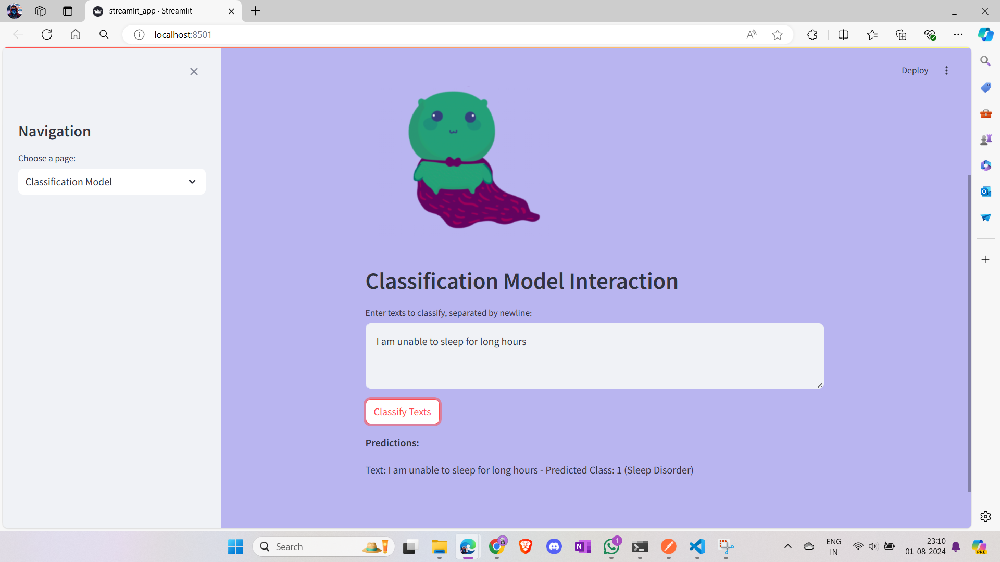

# Mental Health ChatBot InfiHeal Assignment By Shashank

InfiHeal Healo - Empowering People. This Assignment is only for learning purpose, all copyrights belong to InfiHeal.


## Requirements

## Software :- 

Python: Ensure you have Python 3.10 or later installed. 

Docker 

Git

Streamlit

## Python Libraries

Ensure you have the following Python libraries installed

Requests: For making HTTP requests (e.g., used in the Streamlit app).

Transformers: Using the BART Model

Why BART is a Good Fit
BART (Bidirectional and Auto-Regressive Transformers) is a versatile model that can handle a range of NLP tasks, including text generation and understanding. It is well-suited for building a RAG (Retrieval-Augmented Generation) system due to the following reasons:

Pretrained for Generation: BART is a strong model for text generation tasks, aligning with the need to generate responses based on prompts and retrieved articles.
Fully Open Source: BART is available under the Apache 2.0 license, allowing for extensive customization and use.
Customizable: You can fine-tune BART on your specific dataset or use it as-is for generating relevant responses.
Compatibility: BART integrates well with the Transformers library, which is supported by FastAPI.

Streamlit: For creating the web application interface.

FastAPI: For building the FastAPI server.

# Mental Health Chatbot

## Table of Contents

- [Prerequisites](#prerequisites)
- [Setup and Installation](#setup-and-installation)
  - [Creating a Virtual Environment](#creating-a-virtual-environment)
  - [Installing Dependencies](#installing-dependencies)
  - [Setting Up Environment Variables](#setting-up-environment-variables)
- [Project Structure](#project-structure)
- [Running the Application](#running-the-application)
  - [Starting the FastAPI Server](#starting-the-fastapi-server)
  - [Starting the Streamlit App](#starting-the-streamlit-app)
- [Dockerization](#dockerization)
  - [Creating the Dockerfile](#creating-the-dockerfile)
  - [Building and Running the Docker Container](#building-and-running-the-docker-container)
- [Deployment](#deployment)
  - [Deploying to Hugging Face Spaces](#deploying-to-hugging-face-spaces)
- [Customizing the UI](#customizing-the-ui)
  - [Setting Background Color](#setting-background-color)
  - [Adding and Centering an Image](#adding-and-centering-an-image)
- [Using the BART Model](#using-the-bart-model)
  - [Why BART is a Good Fit](#why-bart-is-a-good-fit)
  - [Sample Usage](#sample-usage)
- [Troubleshooting](#troubleshooting)
- [Resources](#resources)

## Prerequisites

Before you start, ensure you have the following:

- **Python 3.10** or later
- **Docker** (for containerization)
- **Git** (for version control)

## Setup and Installation

### Creating a Virtual Environment

1. **Create the Virtual Environment**:

   ```bash
   python -m venv venv

2. **Activate the Virtual Environment**:
    
    Windows:

    venv\Scripts\activate

    Linux/MacOS:

    source venv/bin/activate

You should see (venv) at the beginning of your terminal prompt indicating that the virtual environment is active.

3. **Installing Dependencies** :

pip install -r requirements.txt

4. **Setting Up Environment Variables**:
Create a .env File in the root directory:

ARTICLES_DIR=articles

Ensure ARTICLES_DIR points to the directory containing articles/blogs files.

For better results, Bing Search Api or Google Custom Search API can be integrated for real time articles and blogs.

5. **Fast API Application Files**

app/main.py: Main entry point for the FastAPI application.

app/rag.py: Implementation of the RAG model.

app/classification.py: Implementation of the classification model.

app/streamlit_app.py: Basic Frontend created to view the output

### Running the Application

## Starting the FastAPI Server

uvicorn app.main:app --reload

Access the API at `http://127.0.0.1:8000`.

if default port 8000 unavailable, assign different port

uvicorn app.main:app --reload --port 9000

## Verify FastAPI Endpoints Using PostMan

To verify the endpoints, you can use Postman to make requests to the running application.

1. **Start Postman** and create a new request.

 


   Check working of the FastApi
   `http://127.0.0.1:9000/`

2. **Verify the RAG Endpoint**:
   - **URL**: `http://127.0.0.1:9000/rag`
   - **Method**: `POST`
   - **Headers**: Key= Content-Type ; Value = application/json
   - **Body**: JSON object with the prompt.

   

3. **Verify the Classification Endpoint**:
   - **URL**: `http://127.0.0.1:9000/classification`
   - **Method**: `POST`
   - **Headers**: Key= Content-Type ; Value = application/json
   - **Body**: JSON object with the text to classify.

   

4. **Check Response**: Verify the responses from the endpoints are as expected and troubleshoot any issues using Postman’s console and error messages.

### Starting the Streamlit App

streamlit run app.py

Access the Streamlit UI at `http://127.0.0.1:8501`

## Outputs after running Streamlit




Here, in the dataset, I gave few symptoms. Based on the prompt it will classify whether the person has sleeping disorder, depression etc.

FastAPI: Runs a web server to handle API requests.

Streamlit: Runs a separate server to handle user interface interactions and visualizations.

###FastAPI might run on port 8000(default)  and handles API endpoints
###Streamlit runs on port 8501 and provide a user interface that interacts with the FastAPI endpoints.

### Dockerization

## Creating the Dockerfile

```bash
FROM python:3.10
```bash
WORKDIR /app
```bash
COPY requirements.txt .
```bash
RUN pip install --no-cache-dir -r requirements.txt
```bash
COPY . .
```bash
EXPOSE 8501
```bash
CMD ["streamlit", "run", "app.py"]

Alternatively, we can directly use FastApi server with uvicorn.

```bash
FROM python:3.10-slim

```bash
WORKDIR /app

```bash
COPY requirements.txt .

```bash
RUN pip install --no-cache-dir -r requirements.txt

```bash
COPY . .

# Expose the port FastAPI will run on
```bash
EXPOSE 9000

# Set environment variable for articles directory
```bash
ENV ARTICLES_DIR /app/articles

# Command to run the FastAPI application with Uvicorn
```bash
CMD ["uvicorn", "app.main:app", "--host", "0.0.0.0", "--port", "9000", "--reload"]

## ```bash
docker build -t mental_health_chatbot .

## ```bash
docker run -p 80:80 mental_health_chatbot

### Deployment
Deploying to Hugging Face Spaces
Create a Space: Go to Hugging Face Spaces and create a new Space.

Upload Files: Upload app.py, requirements.txt, and Dockerfile to the Space.

Push Code:

```bash
git init

```bash
git status

```bash
git add .

```bash
git commit -m "Deploy app to Hugging Face Spaces"

```bash
git push


